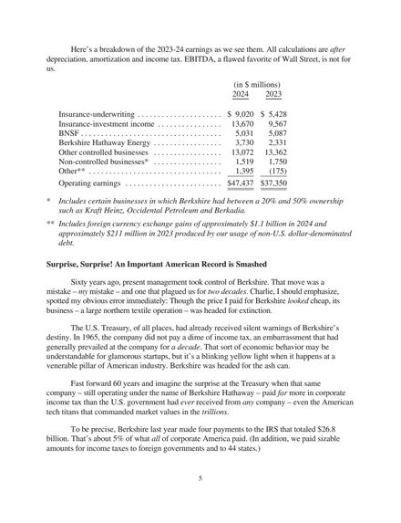
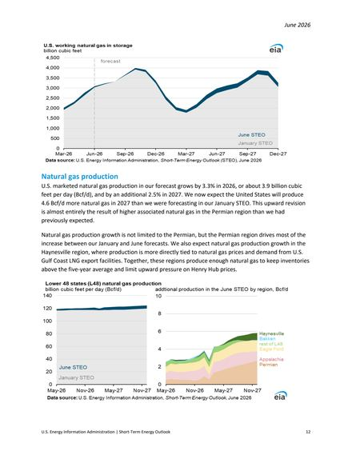
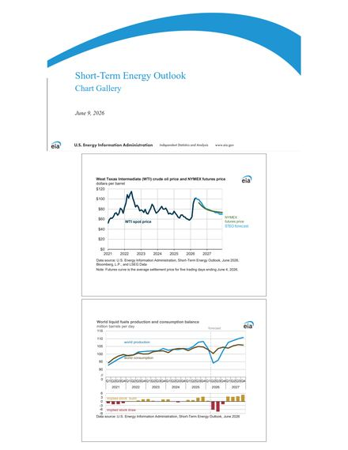
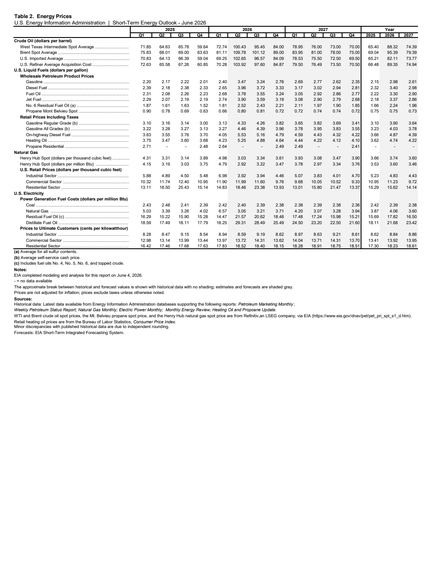

# FinDocIQ — Engineering Case Study

*One-page project report: the problem, the options weighed at each stage, and real output from
every stage of the pipeline. All numbers below are actual captured artifacts, reproducible from
this repo — nothing is illustrative.*

---

## 1. The problem

Financial documents (annual reports, energy outlooks, broker research) are dominated by **charts
and tables**. A text-only RAG pipeline OCRs the PDF, chunks the text, and destroys exactly the
content the questions are about — a quarterly price table or a production-growth chart doesn't
survive chunking. The goal: a QA system that retrieves document **pages as images** and answers
while actually *looking* at them, under hard constraints:

- **No local GPU** and **zero budget** — every component free-tier or open-weights.
- Real-world corpus: Berkshire Hathaway 2024 shareholder letter (15 pages) + EIA Short-Term
  Energy Outlook, June 2026 (60 pages) — prose, dense tables, and chart pages.

## 2. Design decisions — options considered vs. chosen

| Stage | Options considered | Chosen | Why |
|---|---|---|---|
| Page rendering | OCR + chunking; Unstructured.io; **pypdfium2 page→PNG** | pypdfium2 | Keeps visual layout; also extracts raw text for the second lane; zero cost |
| Visual retrieval | CLIP page embeddings (single vector); **ColQwen2.5 late interaction (ColPali)**; caption-then-embed | ColQwen2.5 | Single-vector CLIP collapses a whole page into one point — late interaction keeps ~755 patch vectors per page, so a query token can match one table cell region |
| Text retrieval | BM25; OpenAI embeddings (paid); **BGE-small-en-v1.5** | BGE-small | Open weights, 384-d, runs on CPU; complements the visual lane on prose questions |
| Fusion | Score normalization + weighted sum; learned reranker; **Reciprocal Rank Fusion (k=60)** | RRF | MAX_SIM (~20–30) and cosine (~0.6–0.8) live on incomparable scales; RRF is scale-free and needs no training data |
| Vector DB | FAISS (no server, no payloads); pgvector; **Qdrant** | Qdrant | Native multivector MAX_SIM support + payload storage + free local Docker / 1 GB cloud tier |
| Generation | OCR text → text LLM; **page images → VLM (Gemini 2.5 Flash)**; Ollama qwen2.5-vl (local fallback) | Gemini VLM | The model answers from the rendered page, so table/chart questions work; free tier |
| Evaluation | Vibes; RAGAS; **hit@k / MRR on gold pages + LLM-judge** | Custom | Page-level gold labels make retrieval metrics exact; judge on a *different* model (Flash-Lite) to reduce self-grading bias |
| GPU for indexing | Colab (session limits); Modal (credit card); **Kaggle API kernels** | Kaggle | Scriptable push/status/output CLI → fully automated remote embedding job |

## 3. Pipeline walkthrough — real output at every stage

### Stage 1 — Ingestion (`pypdfium2`)
75 pages rendered to PNG (~990×1290 / 1020×1320 px) + raw text per page + metadata
(`doc_name`, `page_number`, `page_id` like `berkshire_2024_letter::p5`).

### Stage 2 — Dual indexing (ColQwen2.5 + BGE-small → Qdrant)
Embedded on a Kaggle P100 GPU kernel (fp16, batch size 1):

- **Visual lane:** ColQwen2.5 (`vidore/colqwen2.5-v0.2`) — 75 pages × **755 patch vectors ×
  128-d** each (late-interaction multivector, Qdrant MAX_SIM comparator) — ~19 MB of fp16
  artifacts shipped back, instead of the 7.5 GB model.
- **Text lane:** BGE-small (`BAAI/bge-small-en-v1.5`) — 75 × **384-d** dense vectors (cosine),
  embedded on CPU.
- One page (a sparse cover page) produced NaN patch vectors from fp16 overflow — sanitized with
  `nan_to_num` (zero vectors can never win MAX_SIM, so this is lossless for ranking).

### Stage 3 — Hybrid retrieval (the money stage)

Each lane returns its top-15 candidates (`fetch_k = 15`); Reciprocal Rank Fusion (`k = 60`)
merges the two ranked lists and keeps the top 5 (`top_k = 5`) for generation.

**Query:** *"What were Berkshire's insurance-underwriting earnings in 2024, and how do they
compare to 2023?"* — gold page **p5** (the earnings breakdown table).

| Rank | Visual lane (MAX_SIM) | Text lane (cosine) | RRF fused |
|---|---|---|---|
| 1 | **p5** (29.47) ✅ | p4 (0.778) ❌ | **p5** ✅ |
| 2 | p4 (25.42) | **p5** (0.767) | p4 |
| 3 | p10 (23.07) | p10 (0.688) | p10 |

The text lane ranks the prose page p4 first — the extracted text of the table page scores lower
than surrounding narrative. The **visual lane sees the table itself** and ranks p5 first with a
wide margin; fusion keeps it at rank 1.

The same insurance works in **both directions**. For *"How much does the EIA expect US marketed
natural gas production to grow in 2026?"* (gold p13), the visual lane ranks a wrong chart page
p25 first (24.21 vs 23.98 — nearly tied); the text lane ranks p13 first decisively (0.811 vs
0.756), and fusion restores p13 to rank 1. Neither lane alone gets both questions right; the
hybrid gets both.

| Retrieved gold page (visual lane won) | Lane-flip case (text lane won) |
|---|---|
|  |  |

### Stage 4 — VLM generation (page images → Gemini 2.5 Flash)
Top-5 fused page **images** go to the VLM with a citation-forcing prompt. Actual output:

> "Berkshire's insurance-underwriting earnings in 2024 were $9,020 million. This is an increase
> compared to 2023, when they were $5,428 million **[berkshire_2024_letter p.5]**."

Both figures come from the table on p5 — a text-only pipeline never had them intact. The model
also declines correctly: asked for a number the retrieved pages don't contain, it answered
*"The provided document pages do not contain the forecast WTI spot price for Q2 2026"* instead
of hallucinating one (that answer still scored faithfulness 5/5).

### Stage 5 — Evaluation (10 gold-annotated questions, full corpus)

Retrieval is scored exactly against hand-annotated gold pages (hit@k, MRR); answer quality is
scored by Gemini 2.5 Flash-Lite — deliberately a **different model** from the generator — on
separate 1–5 faithfulness and relevance rubrics, with the gold answer in the judge prompt.

| Metric | Score |
|---|---|
| hit@1 | **0.80** |
| hit@5 | **0.90** |
| MRR | **0.83** |
| Faithfulness (LLM-judge, 1–5) | **5.0** |
| Relevance (LLM-judge, 1–5) | **5.0** |

**Failure analysis** — both hit@1 misses are the same shape: quarterly-statistics-table lookups
(e.g. *"WTI spot price for Q2 2026"*, gold p34 below right). The gold page is a wall of small
numbers with almost no distinguishing text or visual structure; both lanes rank the WTI *price
chart* page p17 (below left) above it. That's the known hard case for page-level retrieval — the
fix would be table-aware indexing (extract tables → index rows/cells), which is the first item
in the next-level solution below.

| What both lanes retrieved (p17, chart) | What the gold answer needed (p34, dense table) |
|---|---|
|  |  |

Per-question raw results: [`results/eval_results.json`](../results/eval_results.json).

### Stage 6 — Serving
FastAPI REST API + Streamlit chat UI (shows the retrieved page images alongside the answer) +
Docker Compose. Public demo: [Hugging Face Space](https://huggingface.co/spaces/usamahassan965/findociq-demo).

## 4. Hard problems (ask me about these)

1. **The answer is one cell in a 40-row table — and every retriever walks past it.** The hardest
   question type in the corpus: *"What is the forecast WTI spot price for Q2 2026?"* The answer
   is a single number inside a dense quarterly statistics table (p34), and **both** lanes —
   visual and text — rank a WTI *chart* page (p17) above it. That's not a bug in either encoder;
   it's a granularity mismatch baked into page-level retrieval. A page-level embedding of a
   40-row table dilutes any individual cell into an average of everything around it, while a
   chart about the same topic is semantically "denser" for the query terms. Fusion can't rescue
   you when both voters agree on the wrong page. The failure stays in the report deliberately —
   knowing the exact boundary of the architecture is the point of evaluating it — and it drives
   the first item in the next-level solution below.
2. **Two retrievers, two incomparable scoring universes.** The visual lane scores with
   late-interaction MAX_SIM — an *unbounded sum* over ~30 query-token maxima that landed
   anywhere from 20 to 30 depending on query length — while the text lane returns cosine
   similarity in [0, 1]. Min-max normalizing 15 candidates per lane makes the result hostage to
   each lane's outliers: one freak top score compresses every other candidate toward 0, and the
   same page gets wildly different normalized scores on different queries. Scores were dropped
   entirely in favor of *rank-space* fusion with RRF (`score = Σ 1/(60 + rank)`, fetch_k = 15 per
   lane, top_k = 5 out). The eval shows the fusion earning its keep in both directions: on the
   insurance question the text lane ranks the wrong page first (0.778 vs 0.767) but the visual
   lane's decisive margin (MAX_SIM 29.47) holds p5 at rank 1; on the natural-gas question the
   visual lane is the one that's wrong (24.21 vs 23.98) and the text lane (cosine 0.811) pulls
   p13 back to the top. Neither lane alone gets both questions right.
3. **One NaN embedding took down the entire index.** Running the encoder in fp16 (forced by a
   2016-era Pascal GPU with no bf16 hardware support), exactly 1 page out of 75 came back as 755
   patch vectors of pure `NaN` — and Qdrant rejects NaN payloads at insert time, so the whole
   indexing run died. bf16 and fp16 both use 16 bits, but bf16 keeps float32's exponent range
   (~10³⁸) while fp16 caps at 65,504; one intermediate activation overflowed to `inf`, and
   `inf − inf` in the following normalization produced NaN that propagated through every
   downstream value. Diagnosis: dumped per-page `isnan()` counts, isolated the page — a
   near-blank cover with almost no visual signal. Fix: `nan_to_num` sanitization to zero
   vectors, which is provably safe under MAX_SIM ranking — a zero vector's dot product with any
   query embedding is 0, so a blank page can never outrank a real one.
4. **The index was born on a GPU the serving machine will never have.** Embedding a page means
   pushing it through a 3B-parameter vision model — GPU work. But the demo serves from a free
   CPU-only container, and the 7.5 GB model can't ride along. The way out is an asymmetry worth
   noticing: a *page* costs 755 patch vectors through the full VLM, but a *query* is only ~30
   token vectors — orders of magnitude lighter. So all page embeddings are computed offline on a
   borrowed GPU (a Kaggle kernel) and shipped as a versioned ~19 MB artifact (`embeddings.npz` +
   manifest); serving only ever pays the cheap query-side cost. The indexer treats the artifact
   as a contract: Qdrant point IDs derive as `uuid5(doc_id, page_number)`, so re-ingestion is
   idempotent (re-uploads overwrite instead of duplicating) and embeddings can be regenerated on
   any GPU without touching the serving stack — the classic train-time/serve-time split, applied
   to retrieval.
5. **Getting a vision model to say "I don't know".** A VLM looking at five financial pages will
   happily *read a number off the nearest chart* when the exact figure the user asked for isn't
   there — the most dangerous failure mode in a finance context, because the answer looks
   plausible and cites a real page. Two defenses: retrieval shows its work (the UI displays the
   actual retrieved page images next to the answer, so a wrong number is visually checkable),
   and the generation prompt forces a per-claim `[doc p.N]` citation and an explicit refusal
   path when the retrieved pages don't contain the answer. Measured result: asked for the WTI
   Q2 2026 forecast when retrieval had surfaced the chart page instead of the statistics table,
   the model answered *"The provided document pages do not contain the forecast WTI spot price
   for Q2 2026"* — a correct refusal that still scored faithfulness 5/5, instead of a confident
   wrong number.
6. **An evaluation you can trust on 20 API calls a day.** Two separate problems hide in "just
   have an LLM grade the answers." First, integrity: if the same model generates and grades,
   scores inherit self-grading bias — so Gemini 2.5 Flash answers and Flash-Lite judges, with
   the judge given the gold answer and scoring faithfulness and relevance on separate 1–5
   rubrics rather than one vague "quality" number. Second, feasibility: free-tier keys allow
   roughly 20 requests/day *per model per project*, and the eval needs exactly 10 generations +
   10 judgments. That leaves a budget of *zero* wasted calls, so the eval loop is idempotent —
   every completed answer/judgment is checkpointed to disk immediately, reruns skip finished
   questions, and 429 responses trigger exponential backoff instead of a crash that would burn
   the day's quota. A judge run that dies at question 9 resumes at question 9.

## 5. Next-level solution

What separates this prototype from a production document-intelligence system — each item targets
a measured limitation, not a hypothetical one.

- **Table-aware indexing.** Extract tables at parse time and index row/cell-level granules
  alongside page-level vectors, then route numeric "what was X in Q3" queries to the
  fine-grained index. Directly attacks the only failure mode the eval found (both misses were
  dense-table lookups losing to chart pages).
- **Reranking stage after fusion.** RRF discards score magnitude by design; a cross-encoder
  reranker over the top-15 fused candidates re-reads the actual page content against the query
  and would likely recover the p34-vs-p17 confusions without touching the indexes.
- **Multivector compression for scale.** 755 × 128 fp16 vectors ≈ 189 KB per page — fine at
  75 pages, untenable at 100K. Binary quantization plus two-stage retrieval (mean-pooled
  single-vector recall, then exact MAX_SIM rescoring on the shortlist) cuts storage ~32× with
  minimal ranking loss.
- **Eval at scale, stratified by page type.** 10 hand-written questions prove the pipeline; they
  can't measure it. Generate synthetic QA pairs stratified across prose, table, and chart pages
  (with human spot-checks), so per-page-type hit rates expose exactly where retrieval degrades.
- **Query-adaptive lane weighting.** Today both lanes vote equally in RRF. A lightweight query
  router (is this visual, numeric, or textual intent?) can weight the lanes per query — e.g.
  trust the text lane more on verbatim-phrase questions, the visual lane on chart questions.
- **Production hardening.** Streamed token-by-token answers, retrieved-page image caching,
  request tracing, and retrieval-quality dashboards (rank distributions, per-lane agreement
  rate) so drift is visible before users report it.
